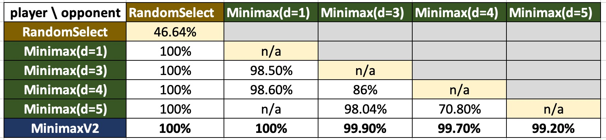

# Subtraction Game
NYCU 2023 Spring Artificial Intelligence Term Project<br/>
init by Shawn Chen (kertansul.cs11@nycu.edu.tw)

## Quick Start Guide

### installation
```bash
cd subtraction-game
pip3 install -r requirements.txt
```

### add these lines to the testing python code
```python
# see 411551039.py as reference
import sys
sys.path.append('SUBTRACTION_GAME_DIRECTORY')  # TODO(shawn): please modify this
from src import agents, environment, heuristic

make_your_move = agents.MinimaxV2(
  max_computing_nodes=1200000,             # to estimate max_depth, use 1.2M or 1M
  heuristic=heuristic.OneStepLookAhead(),  # heuristic function for non-terminal leaf states
  env=environment.SubtractionRule(),       # game rule known by agent (to provide legal moves)
  timeout=58.,                             # to prevent timeout
).make_your_move_method(
  env=environment.SubtractionRule()        # game rule known by environment (to provide legal moves)
)
```

### run the testing python code
```bash
# MinimaxV2 vs. RandomSelect
python3 411551039.py
```


## Project Details

### code structure
```bash
* configs/               # configurations for pytorch dqn & heuristic training
* docs/
* dqn/                   # dataloader, networks for pytorch dqn & heuristic training
* notebooks/             # jupyter notebooks for data analysis & debug
|   * verify_game.ipynb  # verify game rules + check evaluation results
|   * replay.ipynb       # replay a single game (for debug)
* src/
|   * interface.py       # defines modules' API
|   * agents.py          # players for the game (e.g. SelectRandom, GreedyMinimumCost, Minimax, MCTS)
|   * environment.py     # defines game rules (e.g. SubtractionRule)
|   * heuristic.py       # defines heuristic functions
|   * simulate.py        # defines a single game simulation (e.g. TwoPlayerGame)
|   * evaluate.py        # defines multiple game simulations (e.g. TwoPlayerEvaluator) to estimate player strength
* tfrl/                  # tensorflow dqn training
* 411551039.py           # sample code based on TA's template
* eval.py                # evaluate player strength (against another player) (a.k.a run multiple games)
* gen_data.py            # generate training data for heuristic training
* main.py                # run a single game
* train_dqn.py           # train dqn
* train_heuristic.py     # train heuristic function
* train_tfagent.py       # train tfagent
```

### run single game
```bash
# example: Greedy Minimum Cost vs. Random Select
python3 main.py \
  --player1='GreedyMinimumCost()' \
  --player2='RandomSelect()' \
  --save_fn='./game_result.json' \
  --verbose=1
```

### evaluate player strength (against another player) (a.k.a run multiple games)
```bash
# example: Greedy Minimum Cost vs. Random Select
python eval.py \
  --player='GreedyMinimumCost()' \
  --against='RandomSelect()' \
  --logdir='./gmc_vs_random_date1104' \
  --seed=1104 \
  --num_games=100 \
  --num_workers=5
```

## Evaluation Results


* n/a are games that are not evaluated